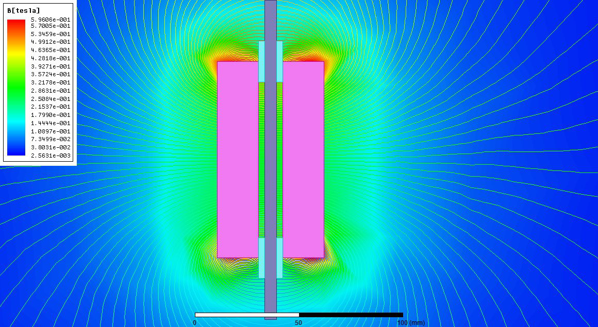
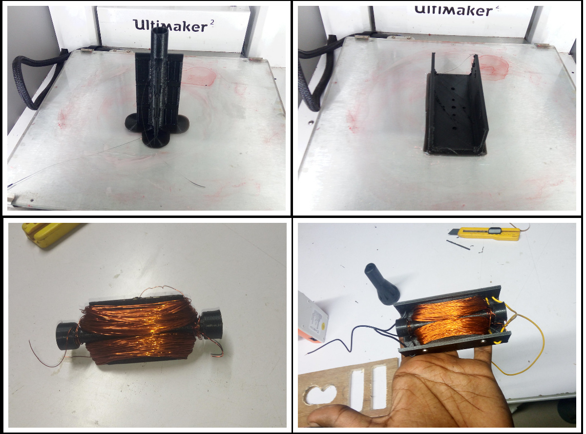
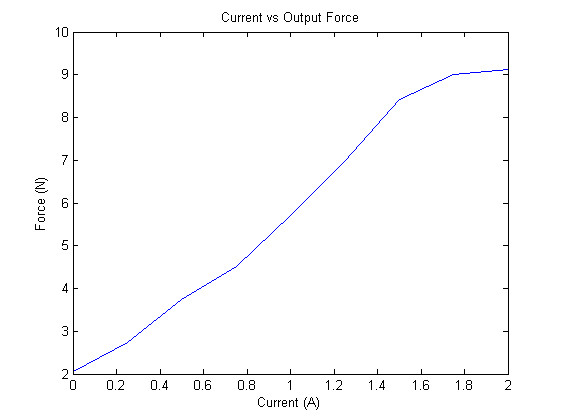
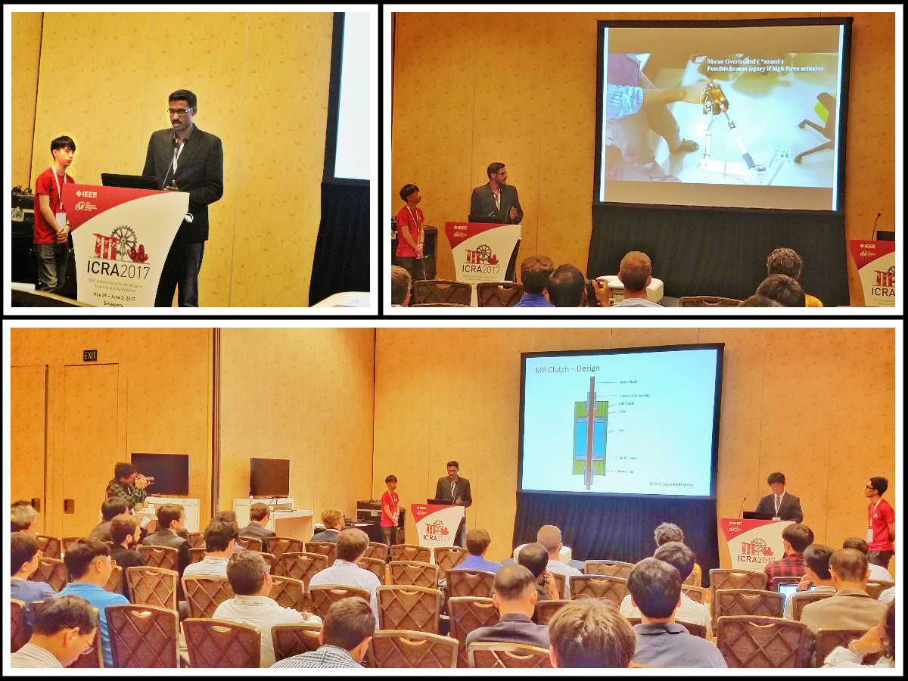

About an year ago, I got lucky enough to attend ICRA 2016 at Stockholm for the HRATC robot competition. I was so much inspired after seeing all the research being published there. I decided pursue a research project, and try to publish a paper in the subsequent conference. The fact that ICRA 2017 is organized in Singapore was also another major factor. It is close to India and I need not spend a fortune on the travel and accommodation expenses. 

## Why I did it?
1. I always wanted to become a scientist and make my little contribution to science/robotics.
2. I wanted to get into a Ph.D program and I had no research papers.
3. To experience how it was like doing research and writing a technical paper.
4. Attend conferences like ICRA and IROS again, meet smart people and their work.

## My Background and Constraints

Ever since I was rejected from a couple of Ph.D programs from 2013-2015, due to lack of research experience, I have been making plans and trying to do research on my own and write a couple of papers. But nothing moved past making elaborate plans and maybe a little literature study for all the research ideas I had. The stresses of working in a startup consume so much of your mental strength as well as time. Thus I failed in materializing all my research Ideas. My research ideas are interdisciplinary and spans over computer vision for robotics, novel actuators for robots, robotic manipulators and motion planning to name a few.

My constraints are:

1. **Demanding Job**:
  Working in a startup is very much different that a normal 9-5 job. You have got multiple responsibilities and more work. On some days I may have to pull all-nighters to meet the deadlines
  
2. **No research experience** :
 Even though I always wanted to be a scientist, I never had any formal training in research. I am mostly a self taught engineer and all my prior works were on building and hacking some stuff.

3. **No mentor** :
 Wish I had some professors to guide me. I was alone and my guide was the books and the Internet.

4. **Limited Time** :
 Since one of the goals of undertaking a research project is going to the next ICRA, I had to submit the paper before 15th September 2016. So, it is barely three and half months.

## Picking up a research topic

The first  challenge was picking up the topic or project to work on. I was clueless and was interested in everything. I started reading through the notes and photos I took at ICRA16. Finally I ended up in the best way possible. The proceedings of the conference were given on a USB drive. It was the first time I had access to this much research papers. It was awesome to go through all of the papers, even though I couldn't understand many of the purely theoretical ones.

Now I had to read through all of them, make notes and think how to build upon that.  Finding time to read all these was the first problem I faced. I cannot sit and read the entire day. I started using Mendeley app on PC and my smartphone to organize the papers and make notes. Having all the papers in my smartphone helped to make use of every bit of time otherwise spent useless. I read during my daily commute to and from work, during meals, when I am travelling outside etc

It was very difficult to indulge in studies and research during this time. I was travelling for client demos of the startup and staying at different places- with friends, relatives, in hotels etc. Moreover, I would be often exhausted after the day's toil, that even the possibility of staying up late reading was not imaginable. Still, I managed to read quite a bit by making best usage of time and not wasting any. Often I would end up sleeping reading some papers on my smartphone or in front of the open laptop.

Even though finding time to read was difficult, there was enough and more time to think. I could think while waiting in traffic blocks, while driving, during meals, and even during boring and useless meetings. My thoughts wandered around various problems associated with direct drive mechanisms and technologies, how animal muscles work and limbs move, tactile and vision feedback, power consumption for these drives etc to name a few.

I had to travel to Chennai for supporting a custome/pdf/2017-mr-clutch-icra.pdfr of my company. I stayed with my relatives in Chennai and the daily commute to the client was about 70 kms. I was traveling in the crowded suburban trains of Chennai and the hot climate made it worse. I had to start my journey at about 8 AM and would be back only by 11PM. I would be very exhausted  by the time I reached back to my room. So reading at night was beyond consideration. But I could make use of the commute time. In total, it took around 7 hours an average per day for my commute. I spend this time reading through the papers that came in the ICRA USB drive. There were over a thousand papers in my reading list. I skimmed through most of them, stopping and reading only those portions I could understand or was interested in. I came across the paper titled " Design and Development of a Hybrid Magneto-Rheological Clutch for Safe Robotic Applications" by Masoud Moghani and Mehrdad R. Kermani. It captured my attention and I began to study more about Magneto-Rheological fluids and their application in human safe robotics. I found out a couple more papers by the same authors on the fundamentals of MR devices.

## Initial explorations, failures

## More experimentation, finalizing the idea
Once I was back at home, I began to delve deep into MR Fluids and their characterization. More reading... More searching.. I came up with an idea to make use of the properties of MR Fluid to make a Linear clutch -  a clutch which controls force transmitted from input to output through MR fluid. 

MR fluids are expensive and the lead-time will be a couple of weeks. Since I cannot afford both, I resorted to making my own MR fluid. I filed myself a piece of iron to the fine powdered form and used vegetable oil as the medium to make my own MR fluid for the prototype.
Here is a small video with the MR fluid



Before starting on the construction, I verified that my concept works in simulation. The following figures show the CAD model, rendered image and the FEM analysis

After that I started working on building the MR clutch. Following photos shows some random shots during the build process. 

 Now I have to procure a couple of items which includes linear shaft bearings, aluminum rods etc.
Once all the parts are procured, the clutch was assembled and the cavity inside was filled with MR Fluid. Then it had to be tested and characteristics were studied

<iframe width = "640" height ="380" src=clutch_photo.jpg ></iframe>

In order to demonstrate the usefulness and study more about the MR linear clutch, a single degree of freedom robot joint was designed and fabricated. It used the standard 30x30 Aluminum profiles. The arm was driven by a Firgelli linear actuator.

/pdf/2017-mr-clutch-icra.pdf

More experiments are done with the arm to validate the functionality of MR Linear clutch.



## Documentation
Experiments are completed and data collected. Now I have to write the paper. Since I didn't have any previous experience writing an academic paper, it took some time.  I read a couple of articles online and referred IEEE guides and instructions. Instead of starting with the abstract and introduction, I started directly with the content- the things I did and the results obtained. Once it was done, I had to refer more literature to write the introductory pages. Luckily, due to the local festival of Onam, I got holidays for a couple of days and could work on the paper full time. Even then, I could felt the time running out fast. I had to plot the graphs, make diagrams and pictures and it took a lot more time than expected. I worked on the paper for about 4days clocking about 20 hours of work daily. Just a couple of hours before the deadline, I completed the final proofreading and submitted the paper. I was so exhausted after this that I literally slept an entire day after this.

The final version of the paper is available [here](/pdf/2017-mr-clutch-icra.pdf)
## Acceptance and Presentation at ICRA 2017

No words could describe the joy and happiness I had when I got the decision in January 2017. My very first paper was accepted. I began preparing for attending the conference.  

Later, I travelled to Singapore to attend ICRA 2017, where I presented my paper.

In addition, I got to meet numerous researchers and even get an a copy of Handbook of Robotics signed by Dr. Oussama Khatib

## Key Takeaways

It was an awesome experience. I pushed myself to the limits, learned a lot of things.

When I started working on the research project, the only thing that mattered to me was doing such an awesome work so that it is accepted at a top conference like ICRA. But as I finished the paper,  I realized that it doesn't matter much whether the paper is accepted or rejected.  The only thing that matters is how much impactful is your work and how much satisfied you are. 

Along the course of working on the paper, I learned much beyond the robotics stuff. The main ones being
 1. **Time Management** :

    In most cases, scientific research and publication of results take an enormous amount of time and resources. It may takes months or even years of research to make an impactful invention and maybe even more months to author a paper on it.   But in my case, the time was fixed as the paper was to be submitted before the deadline, which is just a couple of months away. On top of that, I am working a full-time job  at a startup, which made finding the time extremely difficult. I had to find extra time after my work and make the best use of time wasted. I often slept less, only about 4-5 hours a day.  After my daytime job, I started fiddling with the research projects in the evening and continued till midnight or occassionally to early mornings.

    Having a smartphone always with me was the greatest tool that I used to make best use of time. It was loaded with plenty of books and papers. I had Mendeley on my phone to keep track of all the papers that I am reading. I could read on the phone irrespective of where I am -  while traveling in a crowded bus, when having meals, when having a haircut at the salon, when stuck in a traffic jam, while waiting for someone, when in a queue or even when I am in the toilet seat. These are the bits of time wasted by not being productive. Somehow I managed to squeeze out every bit of time wasted and use it for productive things.
  
2. **Narrow down and Focus** :  
 My initial ideas was to design a clone of MIT Cheetah using direct drive actuators which is a very broad topic. Studies must be done on the actuators, optimum kinematic structure, gait generation, stability and much more. Each of these requires considerable research effort in itself and has only been possible by the collective effort of many researchers. So concentrate on something that may seem simple and small, go deep and push forward. 

3. **Don't re-invent the wheel** :
  This was a lesson that I learned the hard way. Better not to start from scratch, unless your idea is  revolutionary and  novel. Study about and make use of the progress brought about by past researchers.  If some part of your research depends on something that has been previously done, make use of it and build upon it or reuse it. Your time is limited (not just the conference submission deadline), so why to spend time reinventing the wheel, when you can invest it to invent time travel.

4. **You cannot plan a research project explicitly** :
 Coming from a background doing engineering projects, I used to plan all the minute details and had a roadmap for execution. I knew beforehand the progress I would achieve at particular instances of time. It was possible because the path was clear and the results was predictable. Engineering is the often trodden path and research is the one less traveled. ***You may just know the direction but you have to make the path.*** You may be struck with an idea when you least expect it. The results of the research may often come unexpectedly and maybe even in dreams like the discovery structure of Benzene by Kekule. 
 So in short ***Engineering = predictable*** ,while ***Research = unpredictable.*** 

