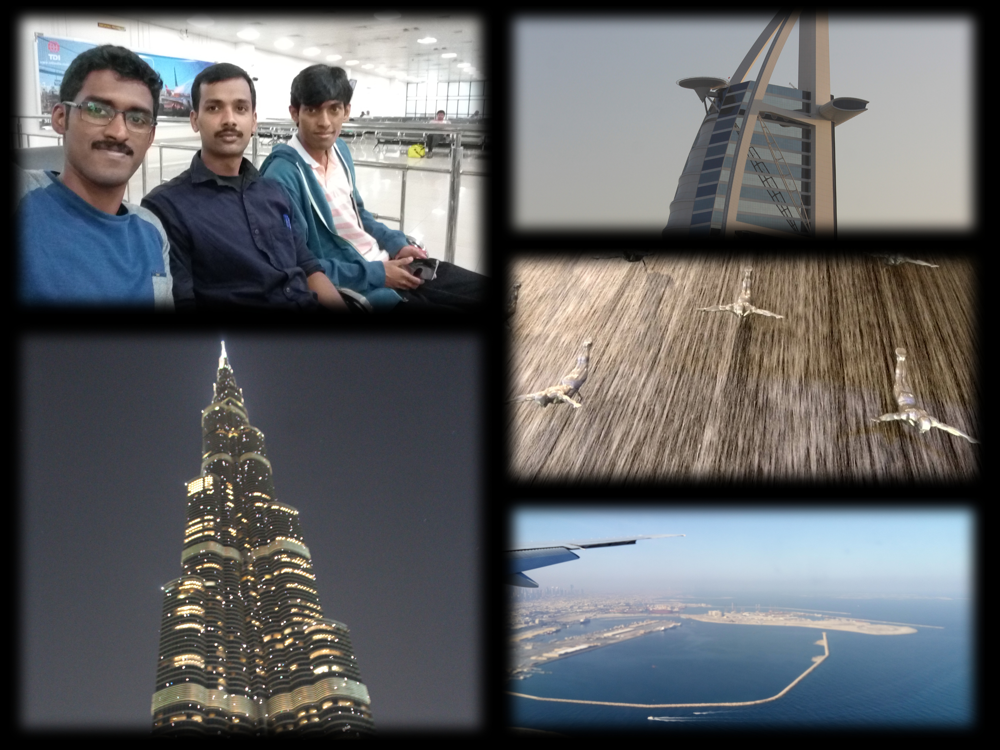
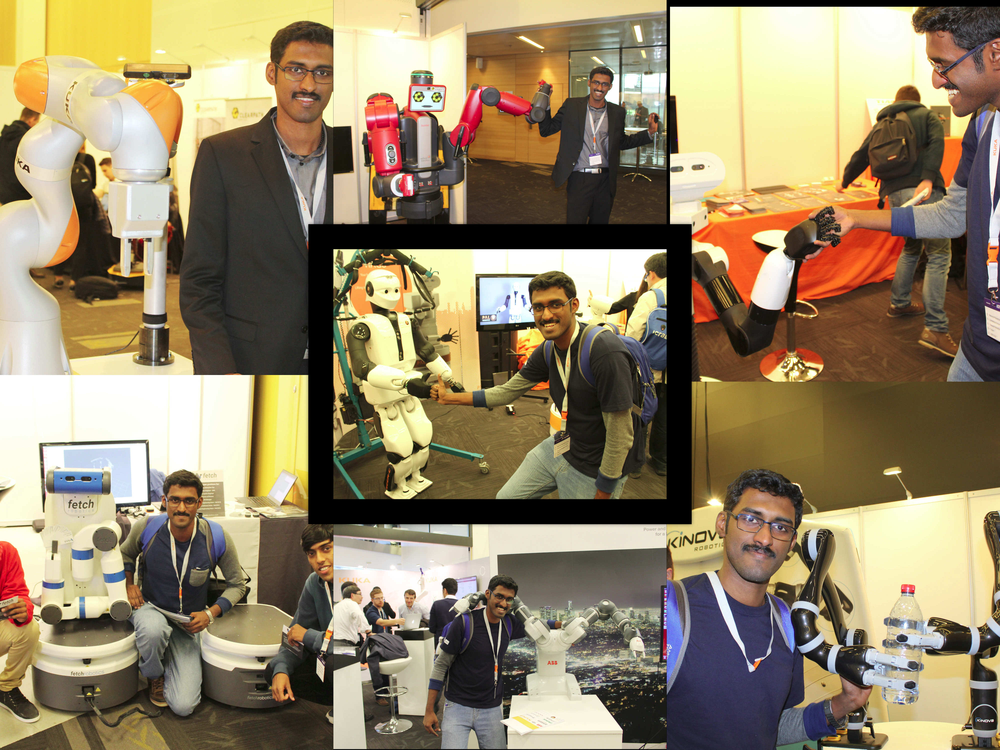
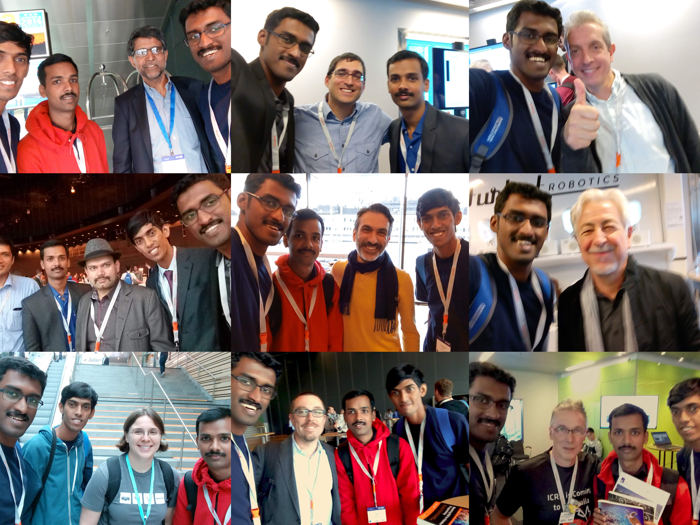
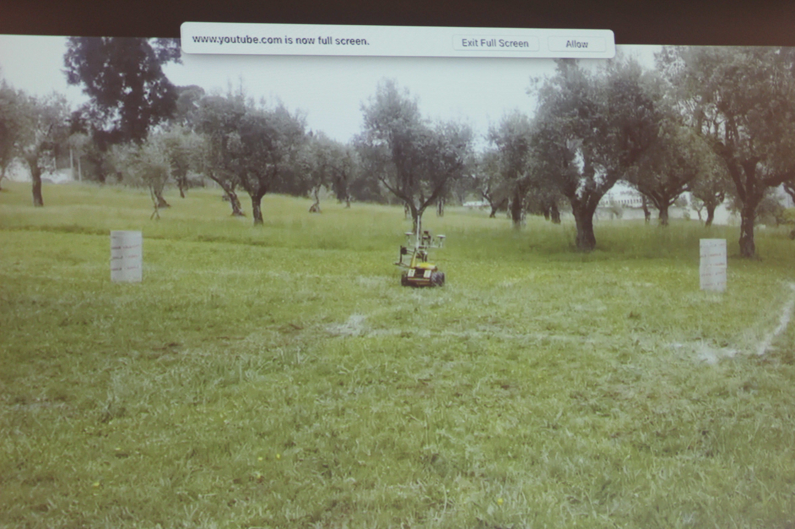
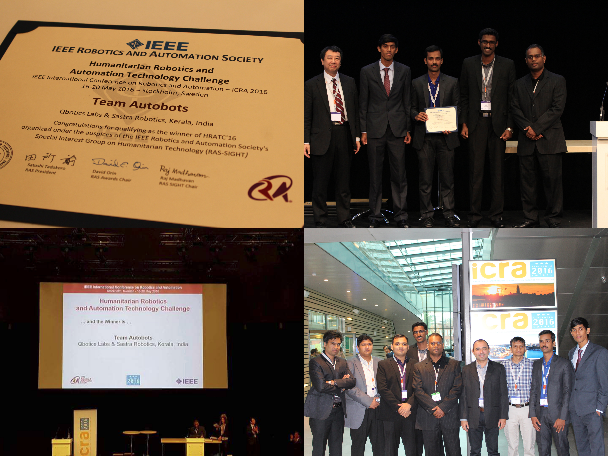
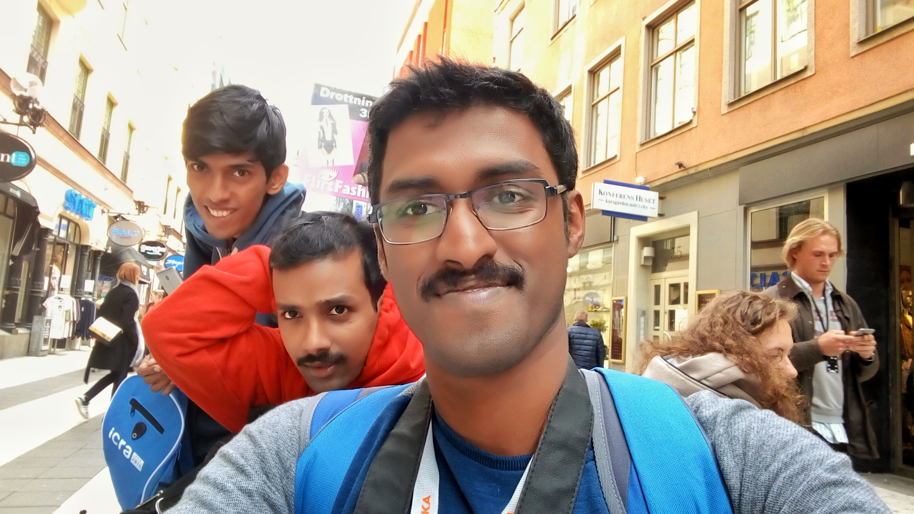

I heard about the International Conference on Robotics and Automation ( ICRA) for the first time around 2013, mainly from the videos posted by IEEE Spectrum and IEEE Video Friday. Soon,  I realized it is the big name robotics conference where academia as well as industry showcase their flashy demos. Since then, for the next couple of years, I would be always looking forward the ICRA time, when there would be a swarm of updates on the most recent research happening in robotics. 

## A way to attend the conference comes up

I always wished to attend these conferences, but not having an academic/research background as well as expensive registration as a non academic and expenses related to travel and accommodation held me back. I realized that there are robot competitions associated with the conference. The Humanitarian Robotics and Automation Technology Challenge (HRATC) attracted me, primarily because it related to autonomous navigation and SLAM, which was something I was exploring at my startup. Secondarily the fact that the competition used ROS as the platform and no hardware was necessary. This relieved us from the hassle and expenses of building hardware. 

So, I teamed with two of my friends, Lentin Joseph & Chandykunju Alex. We named the team Autobots.
The challenge involved autonomously searching and mapping an area for buried landmines using a UGV equipped with a metal detector. Teams were rewarded for detecting a landmine, marking it on the map and on the area covered. Penalties were awarded for running over landmines and crashing into obstacles/trees. Initial elimination stages involved teams competing in the Gazebo simulator. In the intermediate stage, teams were provided real data from the hardware as ROSBAG files and the code would be tested on them. The finals were scheduled to be conducted at ICRA 2016, in Stockholm. Teams would be competing on real robot hardware in the finals. To make it more realistic like an inaccessible landmine filled zone, the competition arena including the robot, landmines, obstacles etc were set up in Portugal and  we were only given an initial remote access to upload our code from Stockholm. After that the robot has to operate autonomously. We cleared the initial rounds effortlessly and made into the finals. Hurray..!! So here comes my opportunity to attend ICRA. I was so excited. This is going to be my first international trip, out of India and how better can it get when it is to the biggest robotics conference. Indeed, a dream come true.

## The travel, an an unexpected visit to Dubai
So, finally, its time to go to Stockholm. We borrowed money from friends and family, registered for the conference, got the visa, booked flight tickets, and decided to stay in an affordable hostel at a walkable distance from the conference venue.  Our flight was from Kochi to Stockholm with a layover in Dubai. Unfortunately, the flight from Kochi got delayed and we missed our connection flight from Dubai. The airlines shifted us to an airport hotel and re-booked the next days flight for us. Even though this seemed unfortunate, we got the chance to spend a day in Dubai and do sightseeing. We visited Burj Khalifa, Palm Jumeirah etc.

## Arriving in Stockholm
The next day, we arrived in Stockholm. After clearing the immigration procedures, we heard our names being called out through the PA system of the airport.  We were requested to report to the airlines desk. Soon, we found out that the airlines forgot to pick our baggage from Dubai. They collected the address of our hostel and promised to deliver it next day( Which they did not until the last day of the conference). So, we are now in a foreign country, with just the dress we are in and the laptop in backpack. 

##  ICRA EXPO
The exhibition stalls at the conference were one thing I was most looking forward to visit. I was excited to see the real robots up so close, the ones that I have seen only in YouTube videos. Moreover I got to have interesting conversations with the people exhibiting them.
I met many other startup founders and could even work out some potential future collaborations.
In addition, we got enough free T-shirts which came handy due to our delayed baggage.
 

##  Meeting my heros
Another aspect was meeting those pioneers in robotics that you have only read about. These included Dr.Wolfram Burgard, Dr.Vijay Kumar from UPenn, Dr.Henrik Christensen,  Dr. Oussama Khatib, Dr. Magnus Egerstedt,  Dr.Melonee Wise, Dr Peter Corke, Dr. Giorgio Metta etc to name a few. I came to know them either as the professors in the MOOCs classes I took or from cool robot videos/research featured on IEEE Spectrum. Meeting them and talking with them (even though I did not had much to contribute) was a dream come true. They can be said of my role models whom I aspire to be one day. ALl of them were very friendly and approachable and we even took selfies with them.

## Winning the challenge
The HRATC challenge was organized over two days.We had to upload our code to the remote robot and video of the robot in operation was live streamed

 Results from the performance on two days were averaged. On the first day, out team scored the lowest. Our navigation stack primarily used GPS coordinates for localization. It was cloudy at the remote robot site and we had trouble getting an accurate GPS fix often. This caused us so much issues in navigation.  After the first day, we pulled an all-nighter to re-write the navigation stack so that it doesn't use GPS always and uses a probabilistic means of localization using the noisy and slippery wheel encoders and the unreliable GPS. We performed  much better the next day. But we were not much hopeful of making it to the top position, given our not that great performance on first day. The winners would only be announced on the last day of the conference. So we spend the rest of the time exploring the conference, attending talks, meeting people, etc. 

 ## Exposure to Research
Attending the conference had a profound impact on my research career in robotics. I was like a kid who was excited about everything. I was interested in everything, ranging from research on robot manipulation, flying robots, navigation, walking robots, novel hardware design and actuation, computer vision, and what not. Being a multi-track conference, it was so difficult for me to catch up with all the talks and presentations happening in different locations. I was running around, taking notes and taking photos of presentations so that I could refer them later. I became aware of the various subfields that I didn't knew existed.  

I addition to getting a broad overview of all the research happening in robotics, I had a firsthand experience of how the academic research and publishing works. I realized that I could also do research and publish papers.  I  realized that many of my side projects, with more experimentation and  documented could be turned into papers.  

## Exploring Stockholm

Since this is the first  international trip for the three of us, we had decided to make the best use of it. We stayed for a couple more days after the conference to explore Stockholm. Since it was May, the weather outside was awesome. The city was clean, safe and filled with greenery. We explored the city mostly on foot.

