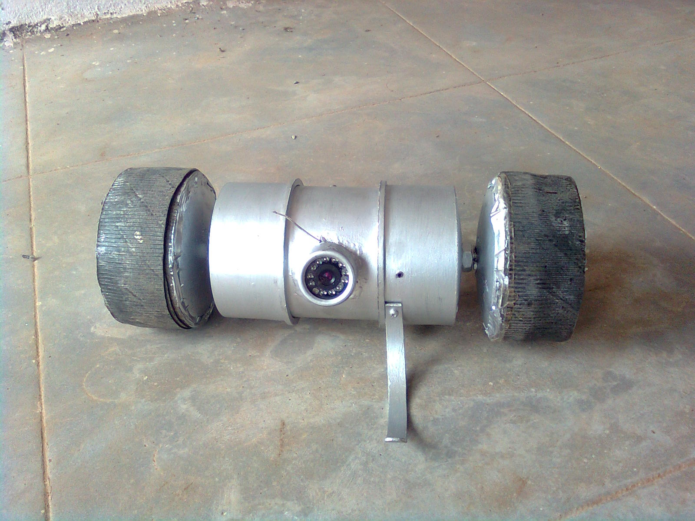

RollerBot is a two wheeled, cylindrical robot, which could be used for remote surveillance applications. It drew inspiration from the Recon Scout ThrowBot[[1]](#)

The main body is made from a PVC pipe which houses the batteries, motors, Camera+Mic, AV transmitter and the RF remote control receiver. The robot is controlled from a remote handheld controller over an RF link. The wheels are custom made and a small leg provides the reaction force for the wheels.

