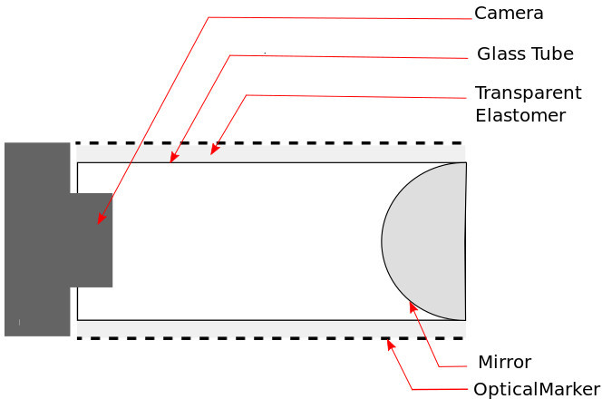

1. [What and why](#what-and-why)
2. [Previous works](#previous-works)
3. [What makes it special](#what-makes-it-special)
4. [Status](#status)
5. [Going Further](#going-further)
6. [Subsequent Works](#subsequent-works)

## What and Why

Robot fingers are almost always flat and rectangular. This is owing to their simplicity in design, control and better contact surface area, thereby giving a better grip. 

However, human fingers are round and more streamlined. It helps hand to navigate/explore in cluttered environments without much difficulty. In addition, the tactile sensing capability all around the human finger surface helps in making better sense of the environment contacts. 
## Previous Works

*#to be update later*

## What makes it special
1. Round the surface tactile sensing
2. Simple construction
3. Cheap and affordable

The cross sectional view of the finger is as shown below

It consists of a cylindrical glass tube coated with a layer of transparent silicone elastomer. The deformable elastomer has colored markers on its outer surface, which is then tracked by a wide angle camera placed at one end of the glass tube. The camera is able to get a 360 degree image of the surface of the finger, which is then de-warped to rectangular images for better understanding and processing. The other end of the tube has a spherical mirror. The reflected image of the markers from the spherical mirror provides view from another angle and is intended to be used in future to reconstruct the three dimensional position of the markers using stereo reconstruction. 

Using off the shelf components ensured that the cost of the modular tactile finger is kept low. A 75 x 12 mm laboratory test tube is used as the cylindrical tube. The elastomer has Shore A hardness of 15 and is made using high transparent platinum cure silicone, which is molded into a thin sheet and wrapped over the test tube. The parabolic mirror is made using a chrome coated metal ball bearing. The finger is compatible with commonly available webcams and better results were obtained using a wide angle Raspberry Pi Camera.



A two finger parallel gripper configuration can be easily achieved using such a finger


## Status
The following image shows the raw output from the camera

and then it is pre-processed and the dots are tracked for its position


## Going Further

The next steps would be attaching it to a gripper and collecting real world data.

## Subsequent Works

These are some subsequent works by others and could be references for future works.
1. [GelTip: A Finger-shaped Optical Tactile Sensor for Robotic Manipulation](https://arxiv.org/abs/2008.05404) by Daniel Gomes et al.[[website]](https://danfergo.github.io/geltip/)
2. [A Sensorized Multicurved Robot Finger with Data-driven Touch Sensing via Overlapping Light Signals](https://arxiv.org/abs/2004.00685) by Pedro Placenza et al. [[video]](https://youtu.be/PVw8Qy7BHU0)

