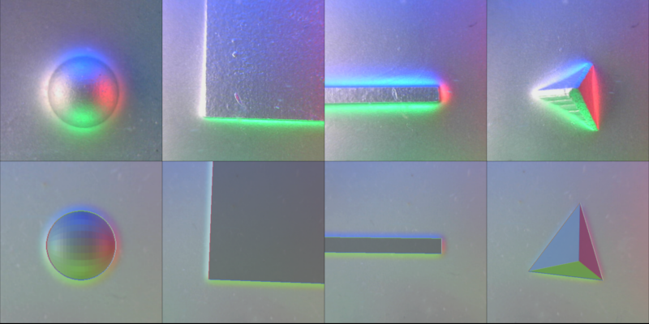

1. [What and why](#what-and-why)
2. [Previous works](#previous-works)
3. [What makes it special](#what-makes-it-special)
4. [Result](#result)

## What and Why

This work explores simulating Gelsight so that agents can be trained in simulation and transferred to real hardware systems with minimal/no difficulties. This would require high fidelity simulation of the GelSight sensor. 

## Previous Works

My initial approach[[1]](#) in simulating Gelsight used raytracing techniques to recreate the 3d pointcloud of the contact surface geometry. In reality, a Poisson solver based surface reconstruction is used to reconstruct the depth image and normals from the gradient image. 

## What makes it special

This approach simulates the raw gradient RGB image coming from the sensor. 
## Result

The following image shows a comparison of the simulated image and the image acquired from the real sensor on similar objects.

The top row of images are acquired from the hardware and the bottom one is the simulated one. 

Here is a [paper](/pdf/2019-sim2real-icra.pdf) detailing the approach, and presented at ICRA 2019 ViTac Workshop.

