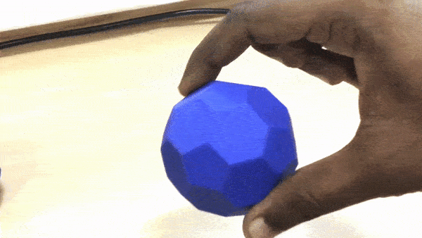

1. [What and why](#what-and-why)
2. [Previous works](#previous-works)
4. [Status](#status)
5. [Going Further](#going-further)

## What and Why

This is quite recent and an exploratory side project. Recently for another project, I trained a CNN to classify the objects being grasped by a hand which has GelSight based tactile sensors. It worked pretty good (~90% accuracy) on my test objects. Analyzing the false classifications indicated that the tactile data may not be perfect during all the grasps. We humans also gets confused in the same way occasionally, if we grab objects with just two fingers. We would then either proceed to close the fingers to make more contact surface area with the object or roll the object between our fingers as in the following video to classify it. 

This would then give us more tactile data and increases our belief probability. This work involves exploring whether such a capability can improve tactile sensing for robots. 

## Previous Works

 Much research has been done in tactile object recognition as well as in hand manipulation[[1]](https://core.ac.uk/download/pdf/77000058.pdf), [[2]](https://ieeexplore.ieee.org/document/7363508). Unlike those approaches. this work explores on learning a finger movement repertoire, that could maximize the in-hand object recognition/localization capabilities. 

## Status

The following video shows the prototype gripper classifying two test objects (geodesic spheres with hexagonal and triangular faces, that can be better felt by touch)

<iframe src="https://drive.google.com/file/d/1bOfoukle06T8DrrSyyc8ingNUB5qe8He/preview" width="640" height="480" align ="center" ></iframe>

We can see that it falsely classifies objects once in a while. 

A modular 3rd axis is inserted in between the finger and the gripper, which can rotate the object in hand. 

<iframe src="https://drive.google.com/file/d/1L_x2ZVm-HVFxSDLjEirT3ZcQ40vBXKNi/preview" width="640" height="480"></iframe>

The classification probabilities during this motion are averaged to get a more accurate estimate of the object.

(Note: it has been tested only with symmetric objects, which are easy to roll and is still an ongoing project)

## Going Further

More experimentation, 3D reconstruction using techniques using ICP.

